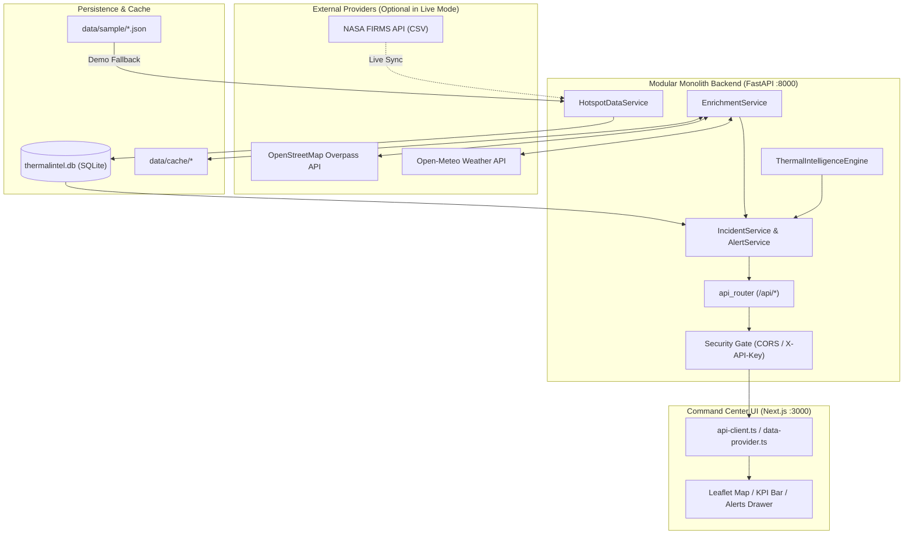

# ThermalIntel V1 Baseline Specification & Phase 0 Lockdown

**Document Version:** 1.0.0  
**Phase:** Phase 0 — Security Lockdown + V1 Baseline  
**Base Commit:** `fac664d7ece21722282b35a5657a0db9df128ee4`  
**Git Baseline Tag:** `thermalintel-v1-baseline`  
**Active Development Branch:** `v2`  
**Date:** October 2026  

---

## 1. Executive Summary

This document establishes the verified operational and security baseline for **ThermalIntel V1** prior to initiating Phase 1–5 enhancements of **ThermalIntel V2**. The system is a modular monolith geospatial AI application designed for satellite thermal anomaly detection, classification, and explainable risk scoring.

All functional capabilities of V1 are preserved, verified by a 161-test backend test suite, clean frontend production build, and golden snapshot fixtures. Critical security vulnerabilities identified during the repository audit (wildcard CORS, unprotected mutation endpoints, and credential leakage risks) have been resolved.

---

## 2. Baseline Verification Evidence

| Subsystem | Metric / Check | Baseline Result | Verification Status |
| :--- | :--- | :--- | :--- |
| **Backend Tests** | Unit, integration, security & regression | **161 passed, 0 failed** in 5.11s |  VERIFIED |
| **Frontend Build** | Next.js 14.2 production compile & typecheck | **Exit code 0**, 4/4 static pages generated |  VERIFIED |
| **API Endpoints** | All 7 contract endpoints | **HTTP 200 OK** in demo mode |  VERIFIED |
| **CORS Policy** | Wildcard `*` check | **Removed**; explicit origin whitelist |  VERIFIED |
| **Mutation Auth** | `POST /api/refresh` security gate | **`X-API-Key` guard active** via `ADMIN_API_KEY` |  VERIFIED |
| **Secret Tracking** | `.env` tracked in git | **Untracked & ignored** (`git ls-files .env` empty) |  VERIFIED |
| **Secret History** | Active keys in git commits | **0 matches** found in commit history |  VERIFIED |

---

## 3. Classification of System Components

### 3.1 PRESERVED (Unchanged Core Functionality)
- **Architecture**: Modular monolith with decoupled service boundaries (`services/api/*`, `services/intelligence/*`).
- **REST Contracts**: All 7 frozen endpoint signatures, parameters, and response schemas:
  - `GET /api/health`
  - `GET /api/hotspots`
  - `GET /api/hotspots/{id}`
  - `GET /api/summary`
  - `GET /api/alerts`
  - `GET /api/sources`
  - `POST /api/refresh`
- **Demo Mode Engine**: Deterministic fallback utilizing `data/sample/sample_hotspots.json` (30 curated thermal records) when API keys are omitted or `force_sample=True`.
- **Enrichment Pipeline**: Dynamic contextual enrichment (OpenStreetMap Overpass queries, Open-Meteo weather parameters, historical spatial recurrence).
- **Intelligence Engine**: Random Forest classification, DBSCAN spatial clustering, Isolation Forest anomaly scoring, and explainable risk factor decomposition.
- **Frontend Dashboard**: Next.js 14 / React 18 / Tailwind CSS command center with interactive Leaflet map, telemetry KPI bar, alerts drawer, and incident dossier inspection.

### 3.2 FIXED IN PHASE 0 (Security Lockdown & Hardening)
- **Secret Containment**:
  - Confirmed `.env` and `apps/web/.env.local` are excluded by `.gitignore` and untracked in Git index.
  - Hardened `.gitignore` with wildcards (`.env.*`, `*.env.local`) while preserving `.env.example` templates.
  - Created root `.env.example` and `apps/web/.env.example` with safe placeholder values and clear instructions.
  - Added secret sanitization (`_mask_key`) in `FirmsClient` (`services/api/ingestion/firms.py`) to prevent API keys from leaking into stdout, logging frameworks, or exception traces.
- **CORS Hardening**:
  - Replaced `allow_origins=["*"]` in `services/api/main.py` with configuration-driven origin resolver `get_cors_origins()` in `services/api/security.py`.
  - Supports comma-separated origins from `CORS_ALLOWED_ORIGINS`.
  - Rejects and filters out any wildcard `*` input.
  - Preserves local development access (`http://localhost:3000`, `http://127.0.0.1:3000`, `http://localhost:5173`, `http://127.0.0.1:5173`).
- **Mutation Endpoint Safety**:
  - Identified mutating route: `POST /api/refresh` (triggers network I/O and database upserts).
  - Added `verify_admin_key` FastAPI dependency in `services/api/security.py` using constant-time comparison (`hmac.compare_digest`).
  - Open in local development/demo when `ADMIN_API_KEY` is unset; enforces `X-API-Key` header with HTTP 401/403 when configured.
- **Regression & Snapshot Baseline**:
  - Generated golden response fixtures in `tests/fixtures/v1_baseline/` for all 7 API endpoints.
  - Created `tests/test_v1_baseline_snapshot.py` to continuously protect contracts and data models against regressions.
  - Created `tests/test_security.py` covering CORS origin resolution, preflight behavior, and mutation endpoint security gates.

### 3.3 DEFERRED TO V2 (Out of Scope for Phase 0)
The following enhancements are explicitly scheduled for later phases and were intentionally not implemented in Phase 0:
1. **Persistent Incident Lifecycle**: Transitioning hotspots to stateful incidents (`active` → `contained` → `extinguished` → `archived`).
2. **Database Schema Overhaul**: Migrations to PostgreSQL / PostGIS or indexed relational SQLite schemas.
3. **Replay & Time Slider Engine**: Historical playback simulation and temporal trajectory analysis.
4. **Intelligence Model Enhancements**: Advanced multi-spectral ML models, satellite pass comparison, and dynamic weather fuel moisture models.
5. **Historical Baseline Redesign**: Multi-year spatial grid indexing and automated recurrence clustering.
6. **OSM Asset Store**: Offline tile storage and regional asset polygon ingestion.
7. **Background Ingestion Scheduler**: Async worker / cron task for automated FIRMS polling.
8. **Frontend State Architecture**: Zustand store refactor and client-side caching.
9. **API Versioning**: Routing migration to `/api/v1/` and `/api/v2/`.
10. **Deployment Artifacts**: Dockerfile, docker-compose, and GitHub Actions CI pipelines.

---

## 4. API Endpoints Contract Specification

| Method | Route | Description | Auth / Security | Sample Response Size |
| :--- | :--- | :--- | :--- | :--- |
| `GET` | `/api/health` | Subsystem health status and data mode | Public | ~290 B |
| `GET` | `/api/hotspots` | Paginated thermal anomalies with risk metrics | Public | ~21 KB |
| `GET` | `/api/hotspots/{id}` | Comprehensive incident dossier & explainability | Public | ~3.3 KB |
| `GET` | `/api/summary` | Real-time operational KPIs and distribution | Public | ~4.1 KB |
| `GET` | `/api/alerts` | Urgent operational anomaly alerts | Public | ~2.4 KB |
| `GET` | `/api/sources` | Thermal source category distribution | Public | ~1.8 KB |
| `POST` | `/api/refresh` | Ingestion sync trigger & dataset reload | `X-API-Key` when configured | ~250 B |

---

## 5. Data Flow Diagram

---

## 6. Security Credential Rotation Advisory

- **Audit Finding**: Untracked `.env` files in local workspaces contained functional credentials for NASA FIRMS (`FIRMS_MAP_KEY`) and CARTO (`NEXT_PUBLIC_CARTO_API_KEY`).
- **Forensic Scan Result**: Exhaustive inspection across all Git commits (`git log --all -S` and regex matching) confirmed that **no real API keys or tokens have ever been committed into the Git repository history**.
- **Advisory Recommendation**: Because credentials existed on local developer disks, both keys should be rotated with upstream providers (NASA Earthdata FIRMS and CARTO) before production deployment as a standard security precaution.
