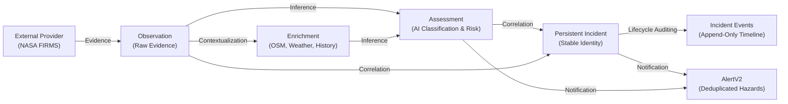

# ThermalIntel V2 Canonical Domain Contracts & Interface Specifications

**Document Version:** 2.0.0  
**Phase:** Phase 1 — Contracts + Database Foundation  
**Status:** **FROZEN**  
**Base Commit:** `7758b89` (`chore(v2): establish secure baseline`)  
**Active Development Branch:** `v2`  
**Date:** October 2026  

---

## 1. Architectural Philosophy & Conceptual Pipeline

ThermalIntel V2 enforces a strict separation of concerns across the intelligence lifecycle. In V1, remote sensing evidence, contextual enrichment, ML classification, and operational hazard scoring were collapsed into a single monolithic `Hotspot` model.

V2 establishes a decoupled, unidirectional processing pipeline:

No stage in this pipeline is permitted to mutate or overwrite data from upstream stages.

---

## 2. Canonical Domain Entities

### 2.1 Observation (`services/api/schemas/v2/observation.py`)
- **Role:** Pure provider evidence. Describes physical radiometric measurements detected by satellite sensors (VIIRS, MODIS).
- **Core Principle:** Contains **NO** ThermalIntel interpretation, ML classification, or risk score.
- **Key Attributes:**
  - `observation_id`: Deterministic unique identifier (e.g. `OBS-VIIRS-SNPP-20261001-0001`).
  - `provider`: Organization providing data (e.g. `NASA_FIRMS`).
  - `product`: Sensor/product identifier (e.g. `VIIRS_SNPP_NRT`).
  - `satellite` & `instrument`: Physical hardware (e.g. `Suomi-NPP`, `VIIRS`).
  - `latitude` & `longitude`: WGS84 decimal degrees (-90 to +90, -180 to +180).
  - `acquisition_time_utc`: ISO 8601 UTC timestamp when satellite sensor recorded the pixel.
  - `ingestion_time_utc`: ISO 8601 UTC timestamp when ThermalIntel received the record.
  - `brightness` & `bright_t31`: Thermal band temperatures in Kelvin.
  - `frp`: Fire Radiative Power in Megawatts ($MW \ge 0.0$).
  - `scan` & `track`: Pixel footprint resolution in kilometers.
  - `daynight`: `'D'` (daytime) or `'N'` (nighttime).
  - `detection_confidence`: Provider-native detection rating (`low`, `nominal`, `high`, or percentage). **Strictly separate from AI classification confidence.**
  - `source_attributes`: Preserved unmapped provider fields for forensic auditing.

### 2.2 Enrichment (`services/api/schemas/v2/enrichment.py`)
- **Role:** External contextual data providing environmental, geographic, and historical dimensions.
- **Core Principle:** Independent provenance per source; explicit handling of unavailable data without fabrication.
- **Supported Context Domains:**
  - `GeospatialEnrichment`: Land cover, nearest settlement distance, nearest critical infrastructure distance, protected conservation areas, terrain slope, elevation.
  - `WeatherEnrichment`: Ambient temperature, relative humidity, wind speed, wind gust, wind direction (degrees + cardinal), 24h precipitation, Fire Weather Index (FWI).
  - `HistoricalEnrichment`: 30-day and 90-day prior detection counts within 1km, recurrence pattern classification, recurrence frequency score.
  - `TerrainEnrichment`: Digital Elevation Model (DEM) slope, aspect, and vegetation fuel load estimate.
- **Atomic Container (`EnrichmentDatum[T]`):**
  - `value`: Typed enriched value (or `None` if provider failed/unavailable).
  - `status`: `'available'`, `'unavailable'`, `'degraded'`, `'error'`.
  - `provenance`: Audit trail including provider, product, observed timestamp, fetched timestamp, freshness state, and TTL.
  - `error_message`: Clear justification if context could not be acquired.

### 2.3 Assessment (`services/api/schemas/v2/assessment.py`)
- **Role:** Comprehensive machine learning and statistical evaluation results.
- **Sub-Assessments:**
  1. `ClassificationAssessment`: Predicted thermal source category (`wildfire`, `industrial`, `agricultural`, `urban`, `prescribed_burn`, `volcanic`), classification posterior probability (0.0 to 1.0), class probability distribution, feature importance weights.
  2. `AnomalyAssessment`: Binary flag `is_anomaly`, normalized outlier index `anomaly_score` (0.0 to 1.0), baseline deviation in sigma ($\sigma$), concise explanatory rationale.
  3. `RiskAssessmentResult`: Composite operational risk score (0.0 to 100.0), severity tier (`low`, `medium`, `high`, `critical`), sub-component breakdown (FRP, weather, proximity, historical), ranked explainable `RiskFactor` list, and recommended action.
  4. `DataQualityAssessment`: Context completeness score (0.0 to 1.0), model uncertainty score (0.0 to 1.0), missing source list.
  5. `AssessmentMethodology`: Model architecture, semantic algorithm version, SHA-256 `input_hash`, and evaluation `as_of_utc` timestamp.

### 2.4 Incident (`services/api/schemas/v2/incident.py`)
- **Role:** Persistent real-world physical event tracked over time.
- **Core Principle:** **Stable Identity Rule**. An Incident ID (`INC-YYYYMMDD-XXXX`) remains permanent once created. It does NOT mutate when new observations are correlated, when the centroid shifts, or when a primary observation changes.
- **Key Attributes:**
  - `incident_id`: Stable primary key.
  - `status`: `active`, `monitoring`, `contained`, `resolved`, `closed`.
  - `first_seen_utc` & `last_seen_utc`: Temporal activity envelope.
  - `centroid_latitude` & `centroid_longitude`: Spatial center of mass.
  - `geometry_geojson`: Optional bounding footprint or convex hull.
  - `peak_frp` & `average_frp`: Aggregate thermal intensity.
  - `observation_count`: Total correlated satellite detections.
  - `current_risk_score`, `current_severity`, `current_classification`: Real-time operational intelligence state.
  - `current_assessment_id`: Pointer to latest Assessment snapshot.

### 2.5 IncidentObservation (`services/api/schemas/v2/incident.py`)
- **Role:** Associative entity connecting Incidents to Observations.
- **Multiplicity:** N:M / 1:N relationship.
- **Key Attributes:**
  - `incident_id` & `observation_id` (enforced unique pair constraint).
  - `joined_at_utc`: Correlation timestamp.
  - `association_method`: Algorithm used (e.g. `dbscan_spatiotemporal`, `proximity_threshold`, `manual`).
  - `association_reason`: Contextual distance or metric justification.

### 2.6 IncidentEvent (`services/api/schemas/v2/event.py`)
- **Role:** Immutable audit trail and chronological timeline for an incident.
- **Lifecycle Events:** `created`, `observation_added`, `escalated`, `deescalated`, `merged`, `split`, `acknowledged`, `closed`, `reopened`.
- **Key Attributes:**
  - `event_id`: Unique identifier.
  - `incident_id`: Associated incident.
  - `event_type`: Standardized event classification.
  - `timestamp_utc`: Time of state change.
  - `actor`: System engine, algorithm, or user initiating change.
  - `reason`: Explanation of transition.
  - `metadata`: Structured state delta (e.g. `{"old_risk": 55.0, "new_risk": 78.0}`).

### 2.7 AlertV2 (`services/api/schemas/v2/alert.py`)
- **Role:** Real-time hazard notification with deduplication and state tracking.
- **Key Attributes:**
  - `alert_id`: Unique identifier.
  - `incident_id` & `observation_id`: Links to target entities.
  - `rule_id`: Evaluation rule (e.g. `RULE_EXTREME_FRP_PROXIMITY`).
  - `dedupe_key`: Unique signature preventing alert flooding for continuing identical hazard conditions.
  - `priority`: `info`, `warning`, `critical`.
  - `state`: `active`, `acknowledged`, `resolved`, `suppressed`.
  - `title`, `message`, `evidence`, `metadata`.
  - `created_at_utc`, `acknowledged_at_utc`, `resolved_at_utc`.

### 2.8 ProviderRun (`services/api/schemas/v2/provider.py`)
- **Role:** Audit and observability telemetry for external service interactions.
- **Security Rule:** **Strict prohibition of secrets.** API keys, credentials, and authentication tokens are defensively rejected.
- **Key Attributes:**
  - `run_id`, `provider`, `product`, `started_at_utc`, `finished_at_utc`, `status` (`running`, `success`, `partial`, `failed`), `rows_received`, `duration_ms`, `error_type`, `error_message`, `request_metadata`, `payload_id`.

### 2.9 RawPayloadMetadata (`services/api/schemas/v2/payload.py`)
- **Role:** Metadata tracking raw external responses preserved on disk or object store for forensic replay.
- **Key Attributes:**
  - `payload_id`, `provider`, `product`, `fetched_at_utc`, `content_hash` (SHA-256), `storage_path`, `content_type`, `size_bytes`, `retention_days`.

---

## 3. Timestamp Semantics & Standards

To eliminate ambiguity across sensors, servers, and historical simulation engines, all V2 entities enforce the following timestamp standards:

1. **Strict UTC:** All persisted and serialized timestamps MUST use ISO 8601 UTC with explicit timezone designation (`YYYY-MM-DDTHH:MM:SSZ` or `+00:00`). Local timezones are strictly forbidden in persistence layers.
2. **Acquisition Time $\ne$ Ingestion Time:**
   - `acquisition_time_utc`: When the satellite sensor physically scanned the earth.
   - `ingestion_time_utc`: When the ThermalIntel backend processed the raw record.
3. **Observed Time $\ne$ Fetched Time:**
   - `observed_at_utc`: When an environmental phenomenon occurred (e.g. weather forecast reference time).
   - `fetched_at_utc`: When ThermalIntel executed the HTTP call to the provider API.
4. **Replay / As-Of Time $\ne$ Wall-Clock Time:**
   - `as_of_utc`: The virtual simulation or evaluation time slice.
   - `created_at_utc`: Physical database write timestamp.

---

## 4. Confidence & Metric Separation Rules

In V1, various confidence, quality, and severity metrics were often conflated. V2 establishes non-overlapping semantics:

| Metric | Origin | Range / Type | Meaning |
| :--- | :--- | :--- | :--- |
| **Detection Confidence** | Satellite Instrument (FIRMS) | `low`, `nominal`, `high`, `0-100%` | Provider sensor signal-to-noise ratio. NOT an AI confidence score. |
| **Classification Confidence** | ThermalIntel ML Classifier | `0.0` to `1.0` | Posterior probability for the predicted thermal source category. |
| **Data Quality / Completeness** | Context Engine | `0.0` to `1.0` | Ratio of available context features vs expected required inputs. |
| **Anomaly Score** | Isolation Forest / Statistical Baseline | `0.0` to `1.0` | Degree of statistical departure from expected regional behavior. |
| **Risk Score** | Multi-factor Risk Engine | `0.0` to `100.0` | Composite operational consequence index. |

---

## 5. Provenance Specification

Every contextual datum implements the `Provenance` model:
- `provider`: Originating service name.
- `product`: Specific dataset / API product.
- `observed_at_utc`: Physical observation timestamp.
- `fetched_at_utc`: Retrieval timestamp.
- `freshness_state`: `fresh`, `cached`, `stale`, `unavailable`.
- `ttl_seconds`: Cache validity window.
- `reference`: Query hash, API URL, or raw storage key.

---

## 6. Rules for Future Parallel Agents

When parallel agents begin implementation in Phases 2–5, the following extension boundaries apply:

- **Agent 1 (Data & Ingestion):**
  - May populate `observations`, `raw_payloads`, and `provider_runs`.
  - Must NOT alter `Observation` schema or remove fields.
- **Agent 2 (Enrichment):**
  - May add new `EnrichmentType` enum members if new providers (e.g. USGS, Sentinel) are introduced.
  - Must store records using `EnrichmentDatum` with explicit provenance.
- **Agent 3 (Intelligence):**
  - May introduce new ML models or feature extractors.
  - Must produce `Assessment` contracts with valid `input_hash`, `algorithm_version`, and `method`.
- **Agent 4 (Incidents & Alerts):**
  - May implement correlation algorithms, merge/split logic, and alert triggers.
  - Must respect `Incident` stable identity and write timeline events to `IncidentEvent`.
- **Agent 5 (Command Center UI):**
  - Consumes V1 endpoints during backward compatibility phase.
  - Transition to V2 schemas must use typed contracts defined in this specification.
