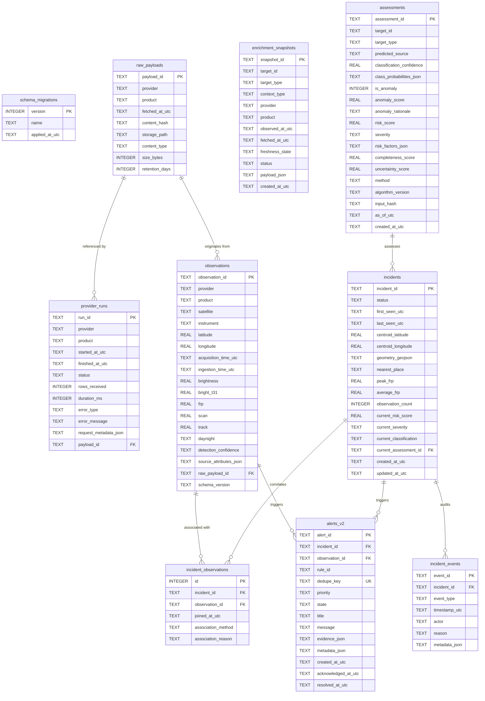

# ThermalIntel V2 Persistence Foundation & Database Specification

**Document Version:** 2.0.0  
**Phase:** Phase 1 — Contracts + Database Foundation  
**Status:** **FROZEN**  
**Storage Engine:** SQLite 3  
**Active Development Branch:** `v2`  
**Date:** October 2026  

---

## 1. Schema Overview

The ThermalIntel V2 persistence architecture transitions the system from flat composite storage into a normalized, decoupled relational model while retaining zero-dependency SQLite for local development and edge deployment.

### Relational Entity-Relationship Diagram



---

## 2. Table Specifications & Indexes

### 2.1 `schema_migrations`
Tracks applied database migration scripts.
- **Columns:** `version` (INT PK), `name` (TEXT), `applied_at_utc` (TEXT).

### 2.2 `provider_runs`
Telemetry records for upstream provider sync calls.
- **Columns:** `run_id` (TEXT PK), `provider` (TEXT), `product` (TEXT), `started_at_utc` (TEXT), `finished_at_utc` (TEXT), `status` (TEXT), `rows_received` (INT), `duration_ms` (INT), `error_type` (TEXT), `error_message` (TEXT), `request_metadata_json` (TEXT), `payload_id` (TEXT FK).
- **Indexes:**
  - `idx_provider_runs_provider`: `(provider)`
  - `idx_provider_runs_status`: `(status)`
  - `idx_provider_runs_started`: `(started_at_utc)`

### 2.3 `raw_payloads`
Content and filesystem metadata for raw external payloads.
- **Columns:** `payload_id` (TEXT PK), `provider` (TEXT), `product` (TEXT), `fetched_at_utc` (TEXT), `content_hash` (TEXT), `storage_path` (TEXT), `content_type` (TEXT), `size_bytes` (INT), `retention_days` (INT).
- **Indexes:**
  - `idx_raw_payloads_hash`: `(content_hash)`
  - `idx_raw_payloads_fetched`: `(fetched_at_utc)`

### 2.4 `observations`
Raw physical satellite thermal detections.
- **Columns:** `observation_id` (TEXT PK), `provider` (TEXT), `product` (TEXT), `satellite` (TEXT), `instrument` (TEXT), `latitude` (REAL), `longitude` (REAL), `acquisition_time_utc` (TEXT), `ingestion_time_utc` (TEXT), `brightness` (REAL), `bright_t31` (REAL), `frp` (REAL), `scan` (REAL), `track` (REAL), `daynight` (TEXT), `detection_confidence` (TEXT), `source_attributes_json` (TEXT), `raw_payload_id` (TEXT FK), `schema_version` (TEXT).
- **Indexes:**
  - `idx_observations_spatial`: `(latitude, longitude)`
  - `idx_observations_acquisition`: `(acquisition_time_utc)`
  - `idx_observations_provider_product`: `(provider, product)`

### 2.5 `enrichment_snapshots`
Contextual points-in-time linked to observations or incidents.
- **Columns:** `snapshot_id` (TEXT PK), `target_id` (TEXT), `target_type` (TEXT), `context_type` (TEXT), `provider` (TEXT), `product` (TEXT), `observed_at_utc` (TEXT), `fetched_at_utc` (TEXT), `freshness_state` (TEXT), `status` (TEXT), `payload_json` (TEXT), `created_at_utc` (TEXT).
- **Indexes:**
  - `idx_enrichment_target`: `(target_id, target_type)`
  - `idx_enrichment_context`: `(context_type)`

### 2.6 `assessments`
Reproducible ML inference and risk evaluation records.
- **Columns:** `assessment_id` (TEXT PK), `target_id` (TEXT), `target_type` (TEXT), `predicted_source` (TEXT), `classification_confidence` (REAL), `class_probabilities_json` (TEXT), `is_anomaly` (INT), `anomaly_score` (REAL), `anomaly_rationale` (TEXT), `risk_score` (REAL), `severity` (TEXT), `risk_factors_json` (TEXT), `completeness_score` (REAL), `uncertainty_score` (REAL), `method` (TEXT), `algorithm_version` (TEXT), `input_hash` (TEXT), `as_of_utc` (TEXT), `created_at_utc` (TEXT).
- **Indexes:**
  - `idx_assessments_target`: `(target_id, target_type)`
  - `idx_assessments_input_hash`: `(input_hash)`
  - `idx_assessments_as_of`: `(as_of_utc)`

### 2.7 `incidents`
Stable real-world incidents with spatial and quantitative tracking.
- **Columns:** `incident_id` (TEXT PK), `status` (TEXT), `first_seen_utc` (TEXT), `last_seen_utc` (TEXT), `centroid_latitude` (REAL), `centroid_longitude` (REAL), `geometry_geojson` (TEXT), `nearest_place` (TEXT), `peak_frp` (REAL), `average_frp` (REAL), `observation_count` (INT), `current_risk_score` (REAL), `current_severity` (TEXT), `current_classification` (TEXT), `current_assessment_id` (TEXT FK), `created_at_utc` (TEXT), `updated_at_utc` (TEXT).
- **Indexes:**
  - `idx_incidents_status`: `(status)`
  - `idx_incidents_severity`: `(current_severity)`
  - `idx_incidents_spatial`: `(centroid_latitude, centroid_longitude)`
  - `idx_incidents_updated`: `(updated_at_utc)`

### 2.8 `incident_observations`
Associative relation between incidents and observations.
- **Columns:** `id` (INTEGER PK AUTOINCREMENT), `incident_id` (TEXT FK), `observation_id` (TEXT FK), `joined_at_utc` (TEXT), `association_method` (TEXT), `association_reason` (TEXT).
- **Unique Constraint:** `UNIQUE (incident_id, observation_id)`
- **Indexes:**
  - `idx_inc_obs_incident`: `(incident_id)`
  - `idx_inc_obs_observation`: `(observation_id)`

### 2.9 `incident_events`
Append-only chronological audit log.
- **Columns:** `event_id` (TEXT PK), `incident_id` (TEXT FK), `event_type` (TEXT), `timestamp_utc` (TEXT), `actor` (TEXT), `reason` (TEXT), `metadata_json` (TEXT).
- **Indexes:**
  - `idx_incident_events_incident`: `(incident_id)`
  - `idx_incident_events_timestamp`: `(timestamp_utc)`
  - `idx_incident_events_type`: `(event_type)`

### 2.10 `alerts_v2`
Canonical operational alerts with deduplication.
- **Columns:** `alert_id` (TEXT PK), `incident_id` (TEXT FK), `observation_id` (TEXT FK), `rule_id` (TEXT), `dedupe_key` (TEXT UNIQUE), `priority` (TEXT), `state` (TEXT), `title` (TEXT), `message` (TEXT), `evidence_json` (TEXT), `metadata_json` (TEXT), `created_at_utc` (TEXT), `acknowledged_at_utc` (TEXT), `resolved_at_utc` (TEXT).
- **Indexes:**
  - `idx_alerts_v2_dedupe`: `(dedupe_key)`
  - `idx_alerts_v2_state`: `(state)`
  - `idx_alerts_v2_priority`: `(priority)`
  - `idx_alerts_v2_incident`: `(incident_id)`
  - `idx_alerts_v2_created`: `(created_at_utc)`

---

## 3. Migration Architecture & Strategy

The migration subsystem is located at `services/api/migrations/`:
- **Engine:** `MigrationRunner` (`runner.py`) written in pure Python using standard library `sqlite3`.
- **Directory Structure:**
  ```
  services/api/migrations/
  ├── __init__.py
  ├── runner.py
  └── sql/
      ├── 0001_v1_baseline.sql
      └── 0002_v2_canonical_schema.sql
  ```

### Migration Execution Rules:
1. **Fresh Database:** Applies `0001` (V1 baseline tables) and `0002` (V2 canonical schema). Version advances to `2`.
2. **Existing V1 Database:** Detects existing `hotspots` table without `schema_migrations`, registers version `1` as already applied, and seamlessly applies `0002`. Zero data loss on existing records.
3. **Idempotency:** Executing `init_db()` or `run_migrations()` multiple times is a safe no-op.
4. **Transactions:** Each migration script is executed in an isolated database transaction. If any statement fails, the transaction rolls back cleanly.

---

## 4. Backward Compatibility Guarantee

All legacy V1 tables remain functional:
- `hotspots`
- `incident_details`
- `alerts`
- `system_meta`

Existing V1 services (`HotspotDataService`, `IncidentService`, `AlertService`, `SummaryService`) and all existing `/api/*` endpoints continue operating without interruption. Bidirectional conversion utilities in `services/api/schemas/v2/converters.py` ensure that future V2 services can map seamlessly between V1 Hotspots and V2 Observations.
