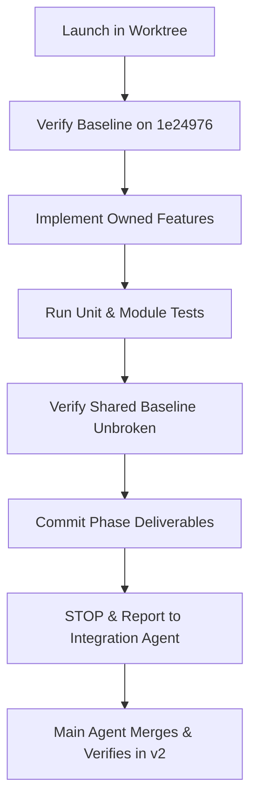

# ThermalIntel V2 Parallel Development Playbook

**Document Version:** 1.0.0  
**Status:** **ACTIVE & ENFORCED**  
**Base Commit:** `1e24976` (`feat(v2): establish domain contracts and database foundation`)  
**Main Integration Workspace:** `/home/sanjeet/.gemini/antigravity-ide/scratch/thermalintel` (`v2` branch)  
**Date:** October 2026  

---

## 1. Executive Summary

This playbook defines the operating protocol for concurrent multi-agent development on ThermalIntel V2. Seven specialized agents operate concurrently within dedicated, isolated Git worktrees. To prevent merge hell, architectural drift, contract divergence, and regression of V1/V2 baseline capabilities, every agent and human contributor must strictly adhere to the rules in this document.

---

## 2. The 12 Cardinal Rules

1. **Base Commit Immutability:** Every agent branch starts from commit `1e24976`. No agent branch may be initialized from an unverified, intermediate, or unmerged feature commit.
2. **Strict Worktree Isolation:** Agents must work **ONLY** inside their assigned worktree directory. Under no circumstances may an agent read/write directly to another agent's worktree or the main integration workspace.
3. **Strict Boundary Enforcement:** Agents must **NOT** modify files outside their primary ownership envelope (as cataloged in [`docs/V2_AGENT_OWNERSHIP.md`](file:///home/sanjeet/.gemini/antigravity-ide/scratch/thermalintel/docs/V2_AGENT_OWNERSHIP.md)). Cross-boundary modifications will be rejected.
4. **No Autonomous Merging:** Agents must **NEVER** merge branches into `v2` or pull/merge code between feature branches directly. All merges are strictly orchestrated by the Main Integration Agent.
5. **Atomic Phase Commits:** Agents commit their own completed phase once their unit/module tests pass and their deliverable is fully verified. Commit messages must follow conventional commits (e.g. `feat(ingestion): ...`).
6. **Task Completion Boundary (Stop Rule):** Each agent must stop immediately upon completing its assigned task and committing its changes. Agents must not proceed to downstream phases or make speculative changes.
7. **Sole Integration Authority:** The Main Integration Agent alone performs merges into `v2`, resolving any integration glue, reviewing cross-boundary contracts, and managing tags.
8. **Comprehensive Integration Verification:** The Main Integration Agent executes the full regression and integration test suite after every merge group (including V1 baseline API tests, migration tests, contract verification, and frontend builds).
9. **No Force-Pushing:** `git push --force` or destructive local branch manipulation is strictly prohibited across all branches.
10. **No History Rewriting:** Git history must remain append-only and linear or cleanly merged. Interactive rebasing (`git rebase -i`), squash rebases that destroy authorship audit trails, and reflog tampering are forbidden.
11. **Zero Secret Leakage:** No credentials, API tokens, FIRMS keys, CARTO keys, or secrets of any kind may ever be committed, logged, or hardcoded. Any detected secret immediately halts integration.
12. **Authoritative Frozen Contracts:** The V2 domain contracts (`services/api/schemas/v2/**`), database schemas (`services/api/migrations/**`), and documentation (`docs/V2_CONTRACTS.md`, `docs/V2_DATABASE.md`) are frozen and authoritative. No agent may unilaterally alter shared schemas.

---

## 3. Worktree & Environment Reference

| Agent | Target Branch | Worktree Absolute Path |
| :--- | :--- | :--- |
| **Main Integration** | `v2` | `/home/sanjeet/.gemini/antigravity-ide/scratch/thermalintel` |
| **Agent A: Data Foundation** | `v2-data-foundation` | `/home/sanjeet/.gemini/antigravity-ide/scratch/thermalintel-agent-data-v2` |
| **Agent B: Enrichment** | `v2-enrichment` | `/home/sanjeet/.gemini/antigravity-ide/scratch/thermalintel-agent-enrichment-v2` |
| **Agent C: Intelligence** | `v2-intelligence` | `/home/sanjeet/.gemini/antigravity-ide/scratch/thermalintel-agent-intelligence-v2` |
| **Agent D: Incidents** | `v2-incidents` | `/home/sanjeet/.gemini/antigravity-ide/scratch/thermalintel-agent-incidents-v2` |
| **Agent E: Alerts / Ops** | `v2-alerts-ops` | `/home/sanjeet/.gemini/antigravity-ide/scratch/thermalintel-agent-alerts-ops-v2` |
| **Agent F: Frontend** | `v2-frontend` | `/home/sanjeet/.gemini/antigravity-ide/scratch/thermalintel-agent-frontend-v2` |
| **Agent G: Replay / Eval** | `v2-replay-eval` | `/home/sanjeet/.gemini/antigravity-ide/scratch/thermalintel-agent-replay-eval-v2` |

### Environment Execution in Worktrees

- **Python Virtualenv:** The virtual environment is located at:
  ```bash
  /home/sanjeet/.gemini/antigravity-ide/scratch/thermalintel/.venv
  ```
  Run python/pytest in any worktree via:
  ```bash
  /home/sanjeet/.gemini/antigravity-ide/scratch/thermalintel/.venv/bin/pytest tests/
  ```
  or activate it within the worktree shell.
- **Frontend Node Modules:** The `apps/web/node_modules` directory in the frontend worktree is symlinked to `/home/sanjeet/.gemini/antigravity-ide/scratch/thermalintel/apps/web/node_modules`.
  To build the frontend in the worktree:
  ```bash
  cd apps/web && npm run build
  ```

---

## 4. Lifecycle of a Parallel Feature Agent



### Step 1: Pre-Execution Sanity Check
Before writing any code, the agent must verify:
```bash
git status
git branch --show-current
git log -1 --oneline
```
Output must confirm branch matches the agent's assigned branch, HEAD is `1e24976`, and working tree is clean.

### Step 2: Implementation Within Owned Envelope
- Implement exclusively in the owned directories defined in [`docs/V2_AGENT_OWNERSHIP.md`](file:///home/sanjeet/.gemini/antigravity-ide/scratch/thermalintel/docs/V2_AGENT_OWNERSHIP.md).
- Never modify files in other agents' domains or integration-owned files (`services/api/schemas/**`, `services/api/migrations/**`, `services/api/database.py`).

### Step 3: Local Verification
The agent must verify that:
1. All new unit tests pass in their own domain.
2. Existing shared tests continue to pass:
   ```bash
   /home/sanjeet/.gemini/antigravity-ide/scratch/thermalintel/.venv/bin/pytest tests/
   ```
3. No secrets or temporary artifacts are left unignored.

### Step 4: Atomic Commit & Stop
When implementation and testing are verified:
1. Stage modified and newly created owned files:
   ```bash
   git add <owned_paths>
   git commit -m "<type>(<scope>): <clear description>"
   ```
2. **STOP Execution.** Do NOT attempt to switch branches, merge into `v2`, or invoke downstream agents. Notify the Main Integration Agent that the phase is ready for integration.

---

## 5. Main Integration Agent Protocol

The Main Integration Agent manages the master `v2` branch and conducts integration in strict phased tiers:

### Tier 1: Ingestion & Enrichment Pipeline
- **Merge Order:**
  1. Merge `v2-data-foundation` (Agent A) into `v2`
  2. Verify: test FIRMS client, raw storage, normalization, provider runs, quarantine
  3. Merge `v2-enrichment` (Agent B) into `v2`
  4. Verify: OSM geospatial queries, weather enrichment, historical recurrence, caching

### Tier 2: Core Analysis & Incidents
- **Merge Order:**
  1. Merge `v2-intelligence` (Agent C) into `v2`
  2. Verify: assessment generator, risk scoring, explainability factors, rule reproducibility
  3. Merge `v2-incidents` (Agent D) into `v2`
  4. Verify: incident correlation, stable ID assignment, event timelines, aggregation

### Tier 3: Operations, Alerts & Presentation
- **Merge Order:**
  1. Merge `v2-alerts-ops` (Agent E) into `v2`
  2. Verify: transition-driven alerts, deduplication keys, cooldowns, summary endpoints
  3. Merge `v2-frontend` (Agent F) into `v2`
  4. Verify: Next.js build, UI components, Leaflet map, incident dossier, accessibility
  5. Merge `v2-replay-eval` (Agent G) into `v2`
  6. Verify: simulated clock, deterministic replay, scenario evaluation harness

### Integration Regression Gate
After every merge into `v2`, the Main Integration Agent executes:
```bash
# Backend test suite
/home/sanjeet/.gemini/antigravity-ide/scratch/thermalintel/.venv/bin/pytest tests/

# V1 golden baseline regression
/home/sanjeet/.gemini/antigravity-ide/scratch/thermalintel/.venv/bin/pytest tests/test_v1_baseline_snapshot.py

# Frontend build
cd apps/web && npm run build
```
Any failure in the integration regression gate must be resolved before proceeding to the next merge.

---

## 6. Contract Change Request (RFC) Protocol

If an agent requires additions to `services/api/schemas/v2/` or a new database column:

1. **Do not modify schemas directly in the agent branch.**
2. File an RFC note in the agent's worktree: `docs/rfcs/RFC-<agent>-<topic>.md` outlining:
   - Proposed field name, type, and nullability
   - Justification and downstream impact
   - Backward compatibility guarantee
3. Main Integration Agent reviews the RFC.
4. If approved:
   - Main Integration Agent applies the change to `services/api/schemas/v2/` and migrations in `v2`.
   - Main Integration Agent commits with message `feat(contract): ...`.
   - Main Integration Agent merges/rebases `v2` into affected agent branches.
5. If rejected: Agent must utilize existing contract extension points (e.g. `metadata: Dict[str, Any]` or `attributes`).

---

## 7. Emergency Conflict & Divergence Protocols

1. **Accidental Cross-Boundary Edits:**
   If an agent mistakenly modified an unowned file, revert that file prior to commit:
   ```bash
   git checkout 1e24976 -- <unowned_file_path>
   ```
2. **Unintended Merge / Detached State:**
   If a worktree enters a detached HEAD or uncoordinated merge state:
   ```bash
   git merge --abort
   git reset --hard 1e24976
   ```
3. **Secret Leak Detection:**
   If any secret is detected in git diff or commit history:
   - Immediately abort commit.
   - Run `git reset HEAD~1` if committed locally.
   - Revoke/rotate the exposed token immediately.
   - Update `.gitignore` and `.env.example`.
